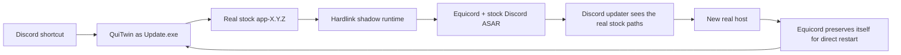

<p align="center">
  
</p>

# QuiTwin

**A one-click, update-resistant Equicord launcher for Discord on Windows.**

[](https://github.com/AriesAlex/QuiTwin/actions/workflows/ci.yml)
[](https://github.com/AriesAlex/QuiTwin/releases/latest)
[](LICENSE)

If Vencord or Equicord keeps disappearing after Discord updates, QuiTwin is built to solve that exact problem—without a background service, scheduled task, DLL injection, or repeatedly patching Discord's live `app.asar`.

> [!IMPORTANT]
> Discord client modifications are unsupported by Discord and may violate its Terms of Service. Use QuiTwin and Equicord at your own risk.

## Download and install

1. Download **`QuiTwin.exe`** from the [latest release](https://github.com/AriesAlex/QuiTwin/releases/latest).
2. Run it once.
3. Done. Start Discord normally from its existing shortcut.

QuiTwin automatically:

- finds Stable, PTB, or Canary even when it is not on `C:`;
- downloads and Authenticode-verifies the official x64 Discord installer if Discord is missing;
- downloads the latest official Equicord `desktop.asar`;
- installs itself as Discord's normal `Update.exe` launch entrypoint;
- starts Discord through an update-safe hardlink runtime.

Windows may show a SmartScreen warning because community release binaries are not code-signed. Every release is built by the public GitHub Actions workflow, or you can build it yourself.

## Why Discord updates remove client mods

Traditional Vencord and Equicord installers replace or wrap:

```text
Discord/app-X.Y.Z/resources/app.asar
```

Discord's current native updater lives in `updater.node`. It downloads a new `app-X.Y.Z`, validates file hashes, commits it in `installer.db`, and may restart the new `Discord.exe` directly. A root `Update.exe` wrapper alone cannot intercept that direct restart, while a modified live `app.asar` can also make delta updates fail.

QuiTwin combines two mechanisms:



1. **Stock host:** the real Discord installation remains byte-for-byte updateable.
2. **Hardlink shadow:** QuiTwin creates a content-addressed runtime under `.quitwin/runtime`. It costs almost no extra disk space because the Discord files are NTFS hardlinks.
3. **Path virtualization:** a tiny JavaScript loader tells Discord's native updater to use the real executable and resources paths, while Equicord loads the shadow's stock ASAR.
4. **Direct restart protection:** Equicord's current host-update hook patches a freshly committed host before Discord's direct post-update restart.
5. **Next normal launch:** QuiTwin restores that host to stock and creates the next shadow generation.

There is no always-running QuiTwin process. `Update.exe` prepares the runtime, starts Discord, and exits.

## Reliability model

- `Update.exe` is replaced atomically with write-through semantics.
- Downloads are staged, length-checked, format-checked, flushed, and atomically published.
- Runtime builds use disposable `.building-*` directories and an atomic directory rename.
- Published runtimes are immutable generations; an in-use generation is never rewritten.
- The real Discord `app.asar` is never moved into an external cache.
- A successful Equicord load writes `.quitwin/last-launch.json` for diagnostics.
- Discord's original uninstaller is not required. QuiTwin handles Windows Settings uninstall with the same single binary.

A power loss can leave an unused staging directory, but not a half-written live Discord host or launcher.

## Updates and uninstall

Discord and Equicord continue to update normally. Running a newer `QuiTwin.exe` upgrades the installed launcher.

To remove Discord and QuiTwin, use:

**Windows Settings → Apps → Installed apps → Discord → Uninstall**

QuiTwin deliberately leaves Discord user data and Equicord settings in `%APPDATA%`, matching normal Discord uninstall expectations.

## Supported systems

- Windows 10 or 11
- x64 Discord Stable, PTB, or Canary
- NTFS (hardlinks are required)

Running QuiTwin on a machine without Discord installs Stable x64. When several channels are installed, QuiTwin prefers Stable, then PTB, then Canary.

## Build from source

Requirements:

- Rust stable with the `x86_64-pc-windows-msvc` target
- Visual Studio Build Tools / MSVC linker

```powershell
cargo test --all-targets
cargo build --locked --release
```

The binary is written to `target\release\quitwin.exe`.

## Project scope

QuiTwin currently installs Equicord, an extended Vencord fork. The architecture is client-mod agnostic, but Vencord is not yet offered as a selectable payload.

QuiTwin is independent from Discord, Equicord, Vencord, and Squirrel. Thanks to those projects for making their source available.

## License

[MIT](LICENSE)
