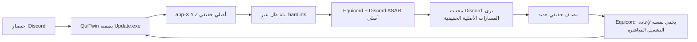

<p align="center">
  <a href="../README.md">EN</a> |
  <a href="README.ru.md">RU</a> |
  <a href="README.sr.md">SR</a> |
  <a href="README.pl.md">PL</a> |
  <a href="README.tr.md">TR</a> |
  <a href="README.fr.md">FR</a> |
  <strong>AR</strong> |
  <a href="README.zh.md">ZH</a>
</p>

<p align="center">
  
</p>

# QuiTwin

**مشغل Equicord لـ Discord على Windows، يثبت بتشغيل واحد ويقاوم التحديثات.**

[الموقع](https://ariesalex.github.io/QuiTwin/ar/) · [كيف يعمل](#لماذا-تزيل-تحديثات-discord-تعديلات-العميل)

[](https://github.com/AriesAlex/QuiTwin/actions/workflows/ci.yml)
[](https://github.com/AriesAlex/QuiTwin/releases/latest)
[](../LICENSE)

<p align="center">
  <a href="https://github.com/AriesAlex/QuiTwin/releases/latest/download/QuiTwin.exe"></a>
</p>
<p align="center"><strong>نزله. شغله مرة واحدة. تم.</strong></p>

إذا كان Vencord أو Equicord يختفي بعد تحديثات Discord، فإن QuiTwin يحل هذه المشكلة تحديدا بلا خدمة خلفية أو مهمة مجدولة أو حقن DLL أو ترقيع متكرر لملف `app.asar` الفعلي.

> [!IMPORTANT]
> لا يدعم Discord تعديلات العميل وقد تخالف شروط خدمته. استخدم QuiTwin وEquicord على مسؤوليتك.

## التنزيل والتثبيت

1. [نزل **`QuiTwin.exe`**](https://github.com/AriesAlex/QuiTwin/releases/latest/download/QuiTwin.exe).
2. شغله مرة واحدة.
3. تم. يحذف ملف EXE الذي نزلته نفسه، وبعدها شغل Discord من اختصاره المعتاد.

يقوم QuiTwin تلقائيا بما يلي:

- يعثر على Stable أو PTB أو Canary حتى لو لم يكن على القرص `C:`;
- ينزل مثبت Discord x64 الرسمي ويتحقق من توقيع Authenticode إن لم يكن Discord مثبتا;
- ينزل أحدث `desktop.asar` رسمي لـ Equicord;
- يثبت نفسه كنقطة تشغيل Discord المعتادة `Update.exe`;
- يشغل Discord من بيئة hardlink مقاومة للتحديثات;
- يشغل صوت Windows Proximity Notification بعد نجاح التثبيت;
- ينتظر إغلاق المثبت المحمول ثم يحذف ملف EXE الذي نزلته.

قد يعرض Windows تحذير SmartScreen لأن ملفات المجتمع ليست موقعة تجاريا. يبنى كل إصدار بواسطة GitHub Actions علنية، ويمكنك أيضا البناء من المصدر.

## لماذا تزيل تحديثات Discord تعديلات العميل

تستبدل مثبتات Vencord وEquicord التقليدية الملف التالي أو تغلفه:

```text
Discord/app-X.Y.Z/resources/app.asar
```

يوجد محدث Discord الأصلي الحالي في `updater.node`. ينزل `app-X.Y.Z` جديدا، ويتحقق من بصمات الملفات، ويسجل الإصدار في `installer.db`، وقد يعيد تشغيل `Discord.exe` الجديد مباشرة. لا يستطيع مجرد تغليف `Update.exe` في الجذر اعتراض إعادة التشغيل هذه، كما قد يجعل تعديل `app.asar` الفعلي تحديثات delta تفشل.

يجمع QuiTwin آليتين:



1. **مضيف أصلي:** يبقى تثبيت Discord الحقيقي قابلا للتحديث بايتا ببايت.
2. **ظل hardlink:** ينشئ QuiTwin بيئة موجهة بالمحتوى داخل `.quitwin/runtime`. لا تستهلك مساحة إضافية تذكر لأن ملفات Discord هي روابط NTFS صلبة.
3. **توجيه المسارات:** يعرض محمل JavaScript صغير للمحدث الأصلي مسارات EXE والموارد الحقيقية، بينما يحمل Equicord ملف ASAR الأصلي من الظل.
4. **حماية إعادة التشغيل المباشرة:** يجهز hook تحديث المضيف في Equicord المضيف الجديد قبل إعادة تشغيل Discord المباشرة.
5. **التشغيل العادي التالي:** يعيد QuiTwin المضيف إلى حالته الأصلية وينشئ جيل الظل التالي.

لا توجد عملية QuiTwin تعمل دائما. يجهز `Update.exe` البيئة ويشغل Discord ثم يغلق.

## نموذج الموثوقية

- يستبدل `Update.exe` بصورة ذرية مع الكتابة الفورية إلى القرص.
- تجهز التنزيلات ويفحص طولها وتنسيقها وتكتب على القرص ثم تنشر بصورة ذرية.
- تبنى بيئات التشغيل في مجلدات `.building-*` مؤقتة وتنشر بإعادة تسمية المجلد بصورة ذرية.
- الأجيال المنشورة ثابتة ولا يعاد أبدا كتابة جيل قيد الاستخدام.
- لا ينقل ملف Discord `app.asar` الحقيقي إلى ذاكرة تخزين خارجية.
- يكتب نجاح تحميل Equicord الملف `.quitwin/last-launch.json` للتشخيص.
- لا يلزم مزيل Discord الأصلي، إذ يتولى QuiTwin الإزالة من إعدادات Windows بالملف التنفيذي نفسه.

قد يترك انقطاع الطاقة مجلدا مؤقتا غير مستخدم، لكنه لا يترك مضيفا فعليا أو مشغلا مكتوبا جزئيا.

## التحديثات والإزالة

يستمر Discord وEquicord في التحديث بصورة طبيعية. يؤدي تشغيل `QuiTwin.exe` أحدث إلى ترقية المشغل المثبت.

لإزالة Discord وQuiTwin:

**إعدادات Windows → التطبيقات → التطبيقات المثبتة → Discord → إزالة التثبيت**

يترك QuiTwin بيانات مستخدم Discord وإعدادات Equicord في `%APPDATA%` مثل إزالة Discord العادية.

## الأنظمة المدعومة

- Windows 10 أو 11
- Discord Stable أو PTB أو Canary x64
- NTFS لأن hardlink مطلوبة

إذا لم يكن Discord مثبتا، يثبت QuiTwin إصدار Stable x64. وعند وجود عدة قنوات تكون الأولوية Stable ثم PTB ثم Canary.

## البناء من المصدر

يلزم Rust stable مع target باسم `x86_64-pc-windows-msvc` وVisual Studio Build Tools مع رابط MSVC.

```powershell
cargo test --all-targets
cargo build --locked --release
```

يكتب الملف التنفيذي في `target\release\quitwin.exe`.

## نطاق المشروع والترخيص

يثبت QuiTwin حاليا Equicord، وهو fork موسع من Vencord. البنية غير مرتبطة بتعديل واحد، لكن اختيار Vencord بصفته payload غير متاح بعد.

QuiTwin مستقل عن Discord وEquicord وVencord وSquirrel.

[MIT](../LICENSE)
