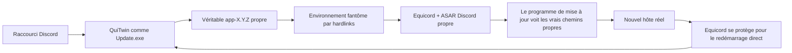

<p align="center">
  <a href="../README.md">EN</a> |
  <a href="README.ru.md">RU</a> |
  <a href="README.sr.md">SR</a> |
  <a href="README.pl.md">PL</a> |
  <a href="README.tr.md">TR</a> |
  <strong>FR</strong> |
  <a href="README.ar.md">AR</a> |
  <a href="README.zh.md">ZH</a>
</p>

<p align="center">
  
</p>

# QuiTwin

**Un chargeur Equicord pour Discord sous Windows, installé en un lancement et résistant aux mises à jour.**

[Site](https://ariesalex.github.io/QuiTwin/fr/) · [Fonctionnement](#pourquoi-les-mises-à-jour-discord-suppriment-les-mods)

[](https://github.com/AriesAlex/QuiTwin/actions/workflows/ci.yml)
[](https://github.com/AriesAlex/QuiTwin/releases/latest)
[](../LICENSE)

<p align="center">
  <a href="https://github.com/AriesAlex/QuiTwin/releases/latest/download/QuiTwin.exe"></a>
</p>
<p align="center"><strong>Téléchargez. Lancez une fois. Terminé.</strong></p>

Si Vencord ou Equicord disparaît après les mises à jour Discord, QuiTwin résout précisément ce problème sans service en arrière-plan, tâche planifiée, injection DLL ni patch répété du fichier `app.asar` actif.

> [!IMPORTANT]
> Les modifications du client ne sont pas prises en charge par Discord et peuvent enfreindre ses Conditions d'utilisation. Utilisez QuiTwin et Equicord à vos risques.

## Téléchargement et installation

1. [Téléchargez **`QuiTwin.exe`**](https://github.com/AriesAlex/QuiTwin/releases/latest/download/QuiTwin.exe).
2. Lancez-le une fois.
3. Terminé. L'EXE téléchargé se supprime lui-même ; lancez ensuite Discord avec son raccourci habituel.

QuiTwin :

- trouve Stable, PTB ou Canary, même si Discord n'est pas sur `C:`;
- télécharge et vérifie par Authenticode l'installateur officiel Discord x64 si Discord manque;
- télécharge le dernier `desktop.asar` officiel d'Equicord;
- s'installe comme point de lancement Discord normal `Update.exe`;
- lance Discord dans un environnement de hardlinks résistant aux mises à jour;
- joue le son Windows Proximity Notification après une installation réussie;
- attend la fermeture de l'installateur portable puis supprime l'EXE téléchargé.

Windows peut afficher un avertissement SmartScreen car les binaires communautaires ne sont pas signés commercialement. Chaque version est construite par le workflow GitHub Actions public et peut aussi être compilée depuis les sources.

## Pourquoi les mises à jour Discord suppriment les mods

Les installateurs Vencord et Equicord classiques remplacent ou enveloppent :

```text
Discord/app-X.Y.Z/resources/app.asar
```

Le programme de mise à jour natif actuel de Discord se trouve dans `updater.node`. Il télécharge un nouveau `app-X.Y.Z`, vérifie les empreintes, valide la version dans `installer.db` et peut redémarrer directement le nouveau `Discord.exe`. Un simple wrapper autour du `Update.exe` racine ne peut pas intercepter ce redémarrage, tandis qu'un `app.asar` actif modifié peut faire échouer les mises à jour delta.

QuiTwin associe deux mécanismes :



1. **Hôte propre :** la véritable installation Discord reste actualisable octet par octet.
2. **Ombre par hardlinks :** QuiTwin crée un environnement adressé par contenu dans `.quitwin/runtime`. Il occupe presque aucun espace supplémentaire car les fichiers Discord sont des hardlinks NTFS.
3. **Virtualisation des chemins :** un petit chargeur JavaScript montre les vrais chemins de l'exécutable et des ressources au programme natif, tandis qu'Equicord charge l'ASAR propre de l'ombre.
4. **Protection du redémarrage direct :** le hook de mise à jour d'Equicord prépare le nouvel hôte avant le redémarrage direct de Discord.
5. **Lancement normal suivant :** QuiTwin restaure cet hôte dans son état propre et crée la génération d'ombre suivante.

Aucun processus QuiTwin ne reste actif. `Update.exe` prépare l'environnement, lance Discord puis se ferme.

## Modèle de fiabilité

- `Update.exe` est remplacé atomiquement avec écriture immédiate sur le disque.
- Les téléchargements sont préparés, contrôlés en taille et format, écrits puis publiés atomiquement.
- Les environnements sont construits dans des dossiers `.building-*` jetables et publiés par renommage atomique.
- Les générations publiées sont immuables et une génération utilisée n'est jamais réécrite.
- Le véritable `app.asar` Discord n'est jamais déplacé vers un cache externe.
- Un chargement Equicord réussi écrit `.quitwin/last-launch.json` pour le diagnostic.
- Le désinstallateur Discord d'origine n'est pas requis : QuiTwin gère la désinstallation depuis les Paramètres Windows avec le même binaire.

Une coupure de courant peut laisser un dossier de préparation inutilisé, mais pas un hôte actif ou un chargeur partiellement écrit.

## Mises à jour et désinstallation

Discord et Equicord continuent à se mettre à jour normalement. Lancer un `QuiTwin.exe` plus récent met à niveau le chargeur installé.

Pour supprimer Discord et QuiTwin :

**Paramètres Windows → Applications → Applications installées → Discord → Désinstaller**

QuiTwin conserve les données utilisateur Discord et les paramètres Equicord dans `%APPDATA%`, comme une désinstallation Discord normale.

## Systèmes pris en charge

- Windows 10 ou 11
- Discord Stable, PTB ou Canary x64
- NTFS, car les hardlinks sont requis

Si Discord n'est pas installé, QuiTwin installe Stable x64. Avec plusieurs canaux, l'ordre de priorité est Stable, PTB, Canary.

## Compilation depuis les sources

Il faut Rust stable avec la cible `x86_64-pc-windows-msvc` et Visual Studio Build Tools avec l'éditeur de liens MSVC.

```powershell
cargo test --all-targets
cargo build --locked --release
```

Le binaire est écrit dans `target\release\quitwin.exe`.

## Périmètre et licence

QuiTwin installe actuellement Equicord, un fork étendu de Vencord. L'architecture est indépendante du mod, mais Vencord n'est pas encore proposé comme payload sélectionnable.

QuiTwin est indépendant de Discord, Equicord, Vencord et Squirrel.

[MIT](../LICENSE)
