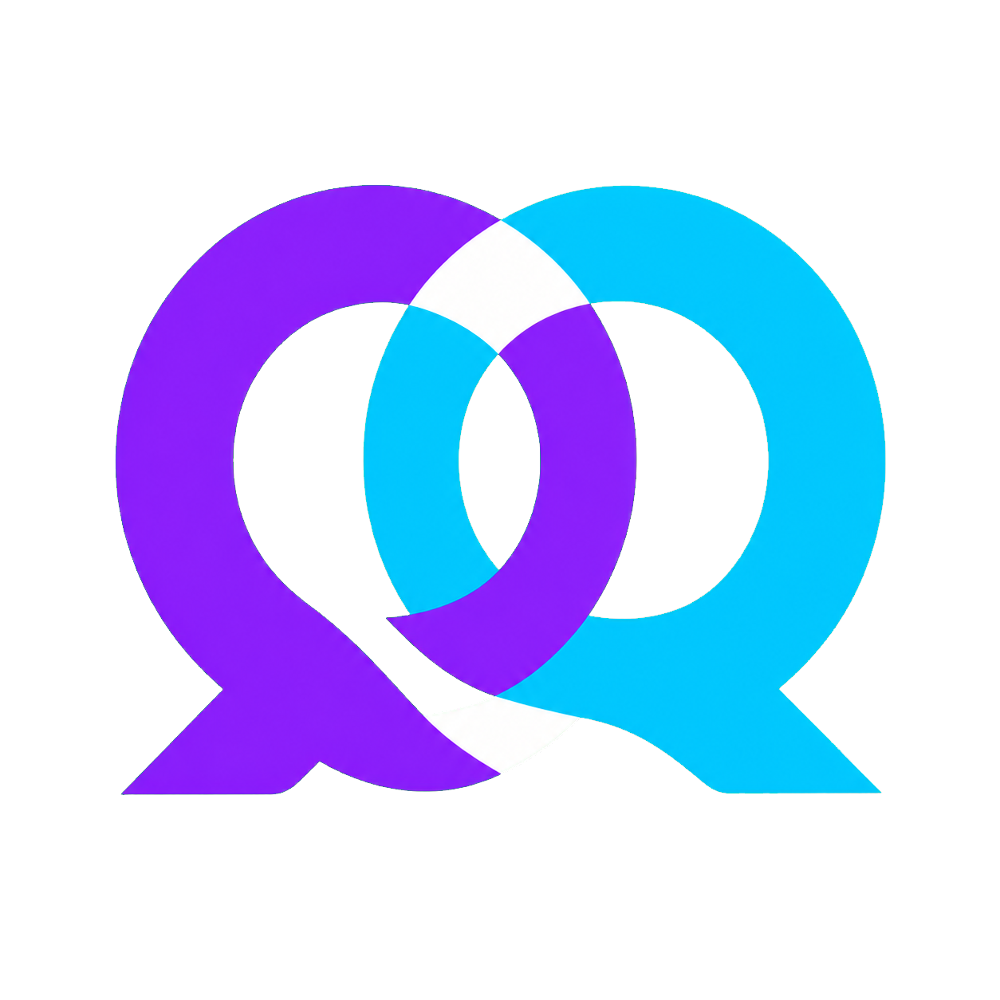
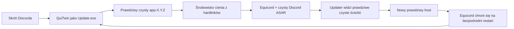

<p align="center">
  <a href="../README.md">EN</a> |
  <a href="README.ru.md">RU</a> |
  <a href="README.sr.md">SR</a> |
  <strong>PL</strong> |
  <a href="README.tr.md">TR</a> |
  <a href="README.fr.md">FR</a> |
  <a href="README.ar.md">AR</a> |
  <a href="README.zh.md">ZH</a>
</p>

<p align="center">
  
</p>

# QuiTwin

**Instalowany jednym uruchomieniem launcher Equicord dla Discorda na Windows, odporny na aktualizacje.**

[Strona](https://ariesalex.github.io/QuiTwin/pl/) · [Jak to działa](#dlaczego-aktualizacje-discorda-usuwają-mody)

[](https://github.com/AriesAlex/QuiTwin/actions/workflows/ci.yml)
[](https://github.com/AriesAlex/QuiTwin/releases/latest)
[](../LICENSE)

<p align="center">
  <a href="https://github.com/AriesAlex/QuiTwin/releases/latest/download/QuiTwin.exe"></a>
</p>
<p align="center"><strong>Pobierz. Uruchom raz. Gotowe.</strong></p>

Jeśli Vencord lub Equicord znika po aktualizacjach Discorda, QuiTwin rozwiązuje dokładnie ten problem bez usługi w tle, zaplanowanego zadania, wstrzykiwania DLL i ciągłego patchowania aktywnego `app.asar`.

> [!IMPORTANT]
> Modyfikacje klienta nie są wspierane przez Discorda i mogą naruszać jego Warunki korzystania. Używasz QuiTwin i Equicord na własne ryzyko.

## Pobieranie i instalacja

1. [Pobierz **`QuiTwin.exe`**](https://github.com/AriesAlex/QuiTwin/releases/latest/download/QuiTwin.exe).
2. Uruchom go raz.
3. Gotowe. Pobrany EXE usunie się sam; później uruchamiaj Discorda zwykłym skrótem.

QuiTwin automatycznie:

- znajduje Stable, PTB lub Canary, nawet jeśli nie są na dysku `C:`;
- pobiera oficjalny instalator Discord x64 i sprawdza Authenticode, jeśli Discorda brakuje;
- pobiera najnowszy oficjalny `desktop.asar` Equicord;
- instaluje się jako normalny punkt startowy Discorda `Update.exe`;
- uruchamia Discorda przez środowisko hardlink odporne na aktualizacje;
- odtwarza dźwięk Windows Proximity Notification po udanej instalacji;
- czeka na zamknięcie przenośnego instalatora i usuwa pobrany EXE.

Windows może pokazać ostrzeżenie SmartScreen, ponieważ binaria społeczności nie mają komercyjnego podpisu. Każde wydanie buduje publiczny workflow GitHub Actions, a kod można zbudować samodzielnie.

## Dlaczego aktualizacje Discorda usuwają mody

Tradycyjne instalatory Vencord i Equicord zmieniają lub opakowują:

```text
Discord/app-X.Y.Z/resources/app.asar
```

Aktualny natywny updater Discorda znajduje się w `updater.node`. Pobiera nowy `app-X.Y.Z`, sprawdza hashe, zapisuje wersję w `installer.db` i może bezpośrednio uruchomić nowy `Discord.exe`. Sam wrapper wokół głównego `Update.exe` nie przechwytuje tego restartu, a zmieniony aktywny `app.asar` może zepsuć aktualizacje delta.

QuiTwin łączy dwa mechanizmy:



1. **Czysty host:** prawdziwa instalacja Discorda pozostaje aktualizowalna bajt w bajt.
2. **Cień z hardlinków:** QuiTwin tworzy środowisko w `.quitwin/runtime`. Zajmuje prawie zero dodatkowego miejsca, bo pliki Discorda są hardlinkami NTFS.
3. **Wirtualizacja ścieżek:** mały loader JavaScript pokazuje updaterowi prawdziwe ścieżki EXE i zasobów, a Equicord ładuje czysty ASAR z cienia.
4. **Ochrona bezpośredniego restartu:** hook Equicord przygotowuje świeżo zainstalowany host przed bezpośrednim restartem Discorda.
5. **Następne zwykłe uruchomienie:** QuiTwin przywraca czysty host i tworzy kolejną generację cienia.

QuiTwin nie ma stale działającego procesu. `Update.exe` przygotowuje środowisko, uruchamia Discorda i kończy pracę.

## Model niezawodności

- `Update.exe` jest zastępowany atomowo z natychmiastowym zapisem na dysk.
- Pobrane pliki są przygotowywane, sprawdzane pod kątem długości i formatu, zapisywane i publikowane atomowo.
- Środowiska powstają w jednorazowych katalogach `.building-*` i są publikowane atomową zmianą nazwy.
- Opublikowane generacje są niezmienne, a używana generacja nigdy nie jest nadpisywana.
- Prawdziwy `app.asar` Discorda nie trafia do zewnętrznego cache.
- Udane załadowanie Equicord zapisuje `.quitwin/last-launch.json` do diagnostyki.
- Oryginalny deinstalator Discorda nie jest potrzebny; QuiTwin obsługuje usuwanie z ustawień Windows tym samym plikiem.

Awaria zasilania może zostawić nieużywany katalog roboczy, ale nie częściowo zapisany aktywny host lub launcher.

## Aktualizacje i usuwanie

Discord i Equicord nadal aktualizują się normalnie. Uruchomienie nowszego `QuiTwin.exe` aktualizuje zainstalowany launcher.

Aby usunąć Discorda i QuiTwin:

**Ustawienia Windows → Aplikacje → Zainstalowane aplikacje → Discord → Odinstaluj**

QuiTwin pozostawia dane użytkownika Discorda i ustawienia Equicord w `%APPDATA%`, tak jak zwykły deinstalator Discorda.

## Obsługiwane systemy

- Windows 10 lub 11
- Discord Stable, PTB lub Canary x64
- NTFS, ponieważ wymagane są hardlinki

Jeśli Discord nie jest zainstalowany, QuiTwin instaluje Stable x64. Przy kilku kanałach kolejność to Stable, PTB, Canary.

## Budowanie ze źródeł

Potrzebne są Rust stable z targetem `x86_64-pc-windows-msvc` oraz Visual Studio Build Tools z linkerem MSVC.

```powershell
cargo test --all-targets
cargo build --locked --release
```

Plik wynikowy znajduje się w `target\release\quitwin.exe`.

## Zakres projektu i licencja

QuiTwin obecnie instaluje Equicord, rozszerzony fork Vencord. Architektura nie jest związana z jednym modem, ale wybór Vencord jako payload nie jest jeszcze dostępny.

QuiTwin jest niezależny od Discorda, Equicord, Vencord i Squirrel.

[MIT](../LICENSE)
