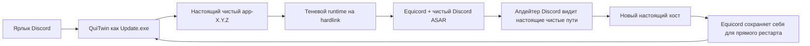

<p align="center">
  <a href="../README.md">EN</a> |
  <strong>RU</strong> |
  <a href="README.sr.md">SR</a> |
  <a href="README.pl.md">PL</a> |
  <a href="README.tr.md">TR</a> |
  <a href="README.fr.md">FR</a> |
  <a href="README.ar.md">AR</a> |
  <a href="README.zh.md">ZH</a>
</p>

<p align="center">
  
</p>

# QuiTwin

**Устойчивый к обновлениям лаунчер Equicord для Discord на Windows, который устанавливается одним запуском.**

[Сайт](https://ariesalex.github.io/QuiTwin/ru/) · [Как это работает](#почему-обновления-discord-удаляют-моды-клиента)

[](https://github.com/AriesAlex/QuiTwin/actions/workflows/ci.yml)
[](https://github.com/AriesAlex/QuiTwin/releases/latest)
[](../LICENSE)

<p align="center">
  <a href="https://github.com/AriesAlex/QuiTwin/releases/latest/download/QuiTwin.exe"></a>
</p>
<p align="center"><strong>Скачайте. Запустите один раз. Готово.</strong></p>

Если Vencord или Equicord постоянно исчезает после обновлений Discord, QuiTwin решает именно эту проблему без фоновой службы, задачи в планировщике, DLL-инъекций и постоянного перепатчивания живого `app.asar`.

> [!IMPORTANT]
> Discord не поддерживает модификации клиента, и они могут нарушать его Условия использования. Используйте QuiTwin и Equicord на свой риск.

## Скачать и установить

1. [Скачайте **`QuiTwin.exe`**](https://github.com/AriesAlex/QuiTwin/releases/latest/download/QuiTwin.exe).
2. Запустите его один раз.
3. Готово. Скачанный EXE удалит себя; дальше запускайте Discord обычным ярлыком.

QuiTwin автоматически:

- находит Stable, PTB или Canary, даже если Discord установлен не на `C:`;
- скачивает официальный установщик Discord x64 и проверяет его Authenticode, если Discord отсутствует;
- скачивает последний официальный `desktop.asar` Equicord;
- устанавливает себя как обычную точку запуска Discord `Update.exe`;
- запускает Discord через устойчивый к обновлениям runtime на hardlink;
- проигрывает звук Windows Proximity Notification после успешной установки;
- дожидается закрытия переносимого установщика и удаляет скачанный EXE.

Windows может показать предупреждение SmartScreen, потому что бинарники сообщества не подписаны коммерческим сертификатом. Каждый релиз собирается публичным GitHub Actions, а исходники доступны для самостоятельной сборки.

## Почему обновления Discord удаляют моды клиента

Обычные установщики Vencord и Equicord заменяют или оборачивают:

```text
Discord/app-X.Y.Z/resources/app.asar
```

Современный родной апдейтер Discord находится в `updater.node`. Он скачивает новый `app-X.Y.Z`, проверяет хэши, фиксирует версию в `installer.db` и может напрямую перезапустить новый `Discord.exe`. Одна обёртка над корневым `Update.exe` не перехватывает такой рестарт, а изменённый живой `app.asar` способен ломать дельта-обновления.

QuiTwin сочетает два механизма:



1. **Чистый хост:** настоящая установка Discord остаётся обновляемой байт в байт.
2. **Тень на hardlink:** QuiTwin создаёт адресуемый по содержимому runtime в `.quitwin/runtime`. Он почти не занимает дополнительного места, потому что файлы Discord являются NTFS hardlink.
3. **Виртуализация путей:** маленький JavaScript-загрузчик показывает родному апдейтеру настоящие пути к EXE и ресурсам, а Equicord загружает чистый ASAR из тени.
4. **Защита прямого рестарта:** текущий хук обновления хоста Equicord патчит только что установленный хост перед прямым перезапуском Discord.
5. **Следующий обычный запуск:** QuiTwin возвращает этот хост в чистое состояние и строит новое поколение тени.

Постоянного процесса QuiTwin нет. `Update.exe` подготавливает runtime, запускает Discord и выходит.

## Модель надёжности

- `Update.exe` заменяется атомарно с немедленной записью на диск.
- Загрузки проходят staging, проверку размера и формата, flush и атомарную публикацию.
- Runtime собирается в одноразовой папке `.building-*` и публикуется атомарным переименованием каталога.
- Опубликованные поколения неизменяемы; используемое поколение никогда не переписывается.
- Настоящий `app.asar` Discord не переносится во внешний кэш.
- Успешная загрузка Equicord пишет `.quitwin/last-launch.json` для диагностики.
- Исходный деинсталлятор Discord не требуется: QuiTwin обслуживает удаление из настроек Windows тем же бинарником.

При отключении питания может остаться неиспользуемая staging-папка, но не наполовину записанный живой хост или лаунчер.

## Обновления и удаление

Discord и Equicord продолжают обновляться обычным способом. Запуск более нового `QuiTwin.exe` обновляет установленный лаунчер.

Чтобы удалить Discord и QuiTwin:

**Параметры Windows → Приложения → Установленные приложения → Discord → Удалить**

QuiTwin оставляет пользовательские данные Discord и настройки Equicord в `%APPDATA%`, как и обычное удаление Discord.

## Поддерживаемые системы

- Windows 10 или 11
- Discord Stable, PTB или Canary x64
- NTFS, потому что требуются hardlink

Если Discord не установлен, QuiTwin поставит Stable x64. При наличии нескольких каналов приоритет такой: Stable, PTB, Canary.

## Сборка из исходников

Нужны Rust stable с target `x86_64-pc-windows-msvc` и Visual Studio Build Tools с линкером MSVC.

```powershell
cargo test --all-targets
cargo build --locked --release
```

Бинарник появится в `target\release\quitwin.exe`.

## Область проекта и лицензия

Сейчас QuiTwin устанавливает Equicord, расширенный форк Vencord. Архитектура не привязана к конкретному моду, но выбор Vencord как payload пока не реализован.

QuiTwin не связан с Discord, Equicord, Vencord и Squirrel. Спасибо этим проектам за доступные исходники.

[MIT](../LICENSE)
