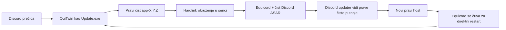

<p align="center">
  <a href="../README.md">EN</a> |
  <a href="README.ru.md">RU</a> |
  <strong>SR</strong> |
  <a href="README.pl.md">PL</a> |
  <a href="README.tr.md">TR</a> |
  <a href="README.fr.md">FR</a> |
  <a href="README.ar.md">AR</a> |
  <a href="README.zh.md">ZH</a>
</p>

<p align="center">
  
</p>

# QuiTwin

**Equicord pokretač za Discord na Windows-u koji se instalira jednim pokretanjem i preživljava ažuriranja.**

[Veb-sajt](https://ariesalex.github.io/QuiTwin/sr/) · [Kako radi](#zašto-discord-ažuriranja-uklanjaju-modove)

[](https://github.com/AriesAlex/QuiTwin/actions/workflows/ci.yml)
[](https://github.com/AriesAlex/QuiTwin/releases/latest)
[](../LICENSE)

<p align="center">
  <a href="https://github.com/AriesAlex/QuiTwin/releases/latest/download/QuiTwin.exe"></a>
</p>
<p align="center"><strong>Preuzmi. Pokreni jednom. Gotovo.</strong></p>

Ako Vencord ili Equicord nestaje posle Discord ažuriranja, QuiTwin rešava upravo taj problem bez pozadinskog servisa, zakazanog zadatka, DLL ubrizgavanja ili stalnog krpljenja aktivnog `app.asar`.

> [!IMPORTANT]
> Discord ne podržava modove klijenta i oni mogu kršiti Uslove korišćenja. QuiTwin i Equicord koristiš na sopstveni rizik.

## Preuzimanje i instalacija

1. [Preuzmi **`QuiTwin.exe`**](https://github.com/AriesAlex/QuiTwin/releases/latest/download/QuiTwin.exe).
2. Pokreni ga jednom.
3. Gotovo. Preuzeti EXE se sam briše; ubuduće pokreći Discord postojećom prečicom.

QuiTwin automatski:

- pronalazi Stable, PTB ili Canary čak i kada nisu na disku `C:`;
- preuzima zvanični Discord x64 instalater i proverava Authenticode ako Discord nedostaje;
- preuzima najnoviji zvanični Equicord `desktop.asar`;
- instalira sebe kao uobičajenu Discord ulaznu tačku `Update.exe`;
- pokreće Discord kroz hardlink okruženje otporno na ažuriranja;
- pušta Windows Proximity Notification zvuk kada instalacija uspe;
- čeka da se prenosivi instalater zatvori i briše preuzeti EXE.

Windows može prikazati SmartScreen upozorenje jer binarni fajl zajednice nije komercijalno potpisan. Svako izdanje gradi javni GitHub Actions tok, a možeš ga izgraditi i iz izvornog koda.

## Zašto Discord ažuriranja uklanjaju modove

Klasični Vencord i Equicord instalateri menjaju ili omotavaju:

```text
Discord/app-X.Y.Z/resources/app.asar
```

Savremeni Discord updater se nalazi u `updater.node`. On preuzima novi `app-X.Y.Z`, proverava heševe, upisuje verziju u `installer.db` i može direktno pokrenuti novi `Discord.exe`. Sam omotač oko korenskog `Update.exe` ne presreće taj restart, a izmenjeni aktivni `app.asar` može pokvariti delta ažuriranje.

QuiTwin kombinuje dva mehanizma:



1. **Čist host:** prava Discord instalacija ostaje potpuno ažurirana.
2. **Hardlink senka:** QuiTwin pravi okruženje u `.quitwin/runtime`. Zauzima skoro bez dodatnog prostora jer su Discord fajlovi NTFS hardlinkovi.
3. **Virtuelizacija putanja:** mali JavaScript učitavač prikazuje updateru prave putanje izvršne datoteke i resursa, dok Equicord učitava čist ASAR iz senke.
4. **Zaštita direktnog restarta:** Equicord-ov hook za ažuriranje hosta priprema nov host pre direktnog Discord restarta.
5. **Sledeće normalno pokretanje:** QuiTwin vraća host u čisto stanje i pravi sledeću generaciju senke.

QuiTwin nema stalni proces. `Update.exe` pripremi okruženje, pokrene Discord i izađe.

## Model pouzdanosti

- `Update.exe` se zamenjuje atomski uz trenutno upisivanje na disk.
- Preuzimanja se pripreme, provere po dužini i formatu, upišu na disk i objave atomski.
- Okruženja se grade u jednokratnim `.building-*` direktorijumima i objavljuju atomskim preimenovanjem.
- Objavljene generacije su nepromenljive i aktivna generacija se nikad ne prepisuje.
- Pravi Discord `app.asar` se ne premešta u spoljašnji keš.
- Uspešno učitavanje Equicord-a zapisuje `.quitwin/last-launch.json` za dijagnostiku.
- Originalni Discord deinstalater nije potreban; QuiTwin obrađuje uklanjanje iz Windows podešavanja istim binarnim fajlom.

Nestanak struje može ostaviti nekorišćen staging direktorijum, ali ne i napola upisan aktivni host ili pokretač.

## Ažuriranja i uklanjanje

Discord i Equicord se i dalje normalno ažuriraju. Pokretanje novijeg `QuiTwin.exe` nadograđuje instalirani pokretač.

Za uklanjanje Discord-a i QuiTwin-a otvori:

**Windows Settings → Apps → Installed apps → Discord → Uninstall**

QuiTwin ostavlja Discord korisničke podatke i Equicord podešavanja u `%APPDATA%`, isto kao normalno uklanjanje Discord-a.

## Podržani sistemi

- Windows 10 ili 11
- Discord Stable, PTB ili Canary x64
- NTFS, jer su hardlinkovi obavezni

Ako Discord nije instaliran, QuiTwin instalira Stable x64. Ako postoji više kanala, redosled je Stable, PTB, Canary.

## Izgradnja iz izvornog koda

Potrebni su Rust stable sa targetom `x86_64-pc-windows-msvc` i Visual Studio Build Tools sa MSVC linkerom.

```powershell
cargo test --all-targets
cargo build --locked --release
```

Binarni fajl se nalazi u `target\release\quitwin.exe`.

## Opseg projekta i licenca

QuiTwin trenutno instalira Equicord, prošireni Vencord fork. Arhitektura nije vezana za jedan mod, ali izbor Vencord payload-a još nije dostupan.

QuiTwin je nezavisan od projekata Discord, Equicord, Vencord i Squirrel.

[MIT](../LICENSE)
