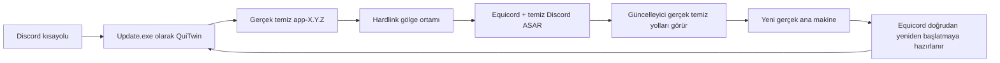

<p align="center">
  <a href="../README.md">EN</a> |
  <a href="README.ru.md">RU</a> |
  <a href="README.sr.md">SR</a> |
  <a href="README.pl.md">PL</a> |
  <strong>TR</strong> |
  <a href="README.fr.md">FR</a> |
  <a href="README.ar.md">AR</a> |
  <a href="README.zh.md">ZH</a>
</p>

<p align="center">
  
</p>

# QuiTwin

**Windows üzerinde Discord için tek çalıştırmayla kurulan, güncellemeye dayanıklı Equicord başlatıcısı.**

[Web sitesi](https://ariesalex.github.io/QuiTwin/tr/) · [Nasıl çalışır](#discord-güncellemeleri-modları-neden-siler)

[](https://github.com/AriesAlex/QuiTwin/actions/workflows/ci.yml)
[](https://github.com/AriesAlex/QuiTwin/releases/latest)
[](../LICENSE)

<p align="center">
  <a href="https://github.com/AriesAlex/QuiTwin/releases/latest/download/QuiTwin.exe"></a>
</p>
<p align="center"><strong>İndir. Bir kez çalıştır. Bitti.</strong></p>

Vencord veya Equicord Discord güncellemelerinden sonra sürekli kayboluyorsa QuiTwin tam olarak bu sorunu; arka plan servisi, zamanlanmış görev, DLL enjeksiyonu veya aktif `app.asar` dosyasını sürekli yamalamadan çözer.

> [!IMPORTANT]
> İstemci modları Discord tarafından desteklenmez ve Hizmet Koşullarını ihlal edebilir. QuiTwin ve Equicord'u kendi riskinizle kullanın.

## İndirme ve kurulum

1. [**`QuiTwin.exe`** dosyasını indirin](https://github.com/AriesAlex/QuiTwin/releases/latest/download/QuiTwin.exe).
2. Bir kez çalıştırın.
3. Bitti. İndirilen EXE kendini siler; bundan sonra Discord'u mevcut kısayoluyla açın.

QuiTwin otomatik olarak:

- `C:` dışında olsa bile Stable, PTB veya Canary kurulumunu bulur;
- Discord yoksa resmi x64 kurucuyu indirir ve Authenticode imzasını doğrular;
- en son resmi Equicord `desktop.asar` dosyasını indirir;
- kendini Discord'un normal `Update.exe` başlatma noktası olarak kurar;
- Discord'u güncellemeye dayanıklı hardlink ortamından başlatır;
- başarılı kurulumda Windows Proximity Notification sesini çalar;
- taşınabilir kurucunun kapanmasını bekler ve indirilen EXE'yi siler.

Topluluk ikilileri ticari olarak imzalanmadığı için Windows SmartScreen uyarısı gösterebilir. Her sürüm açık GitHub Actions iş akışıyla oluşturulur ve kaynak koddan da derlenebilir.

## Discord güncellemeleri modları neden siler

Geleneksel Vencord ve Equicord kurucuları şu dosyayı değiştirir veya sarar:

```text
Discord/app-X.Y.Z/resources/app.asar
```

Discord'un güncel yerel güncelleyicisi `updater.node` içindedir. Yeni `app-X.Y.Z` sürümünü indirir, hashleri doğrular, sürümü `installer.db` içine kaydeder ve yeni `Discord.exe` dosyasını doğrudan başlatabilir. Yalnızca kök `Update.exe` etrafındaki bir sarmalayıcı bu yeniden başlatmayı yakalayamaz. Değiştirilmiş aktif `app.asar` ise delta güncellemelerini bozabilir.

QuiTwin iki mekanizmayı birleştirir:



1. **Temiz ana makine:** gerçek Discord kurulumu bayt bayt güncellenebilir kalır.
2. **Hardlink gölge:** QuiTwin `.quitwin/runtime` altında içeriğe göre adreslenen ortam kurar. Discord dosyaları NTFS hardlink olduğundan neredeyse ek alan kullanmaz.
3. **Yol sanallaştırma:** küçük JavaScript yükleyici yerel güncelleyiciye gerçek EXE ve kaynak yollarını gösterirken Equicord gölgedeki temiz ASAR'ı yükler.
4. **Doğrudan yeniden başlatma koruması:** Equicord host-update hook'u yeni kurulan ana makineyi Discord'un doğrudan yeniden başlatmasından önce hazırlar.
5. **Sonraki normal açılış:** QuiTwin ana makineyi temiz duruma döndürür ve yeni gölge nesli oluşturur.

Sürekli çalışan QuiTwin süreci yoktur. `Update.exe` ortamı hazırlar, Discord'u başlatır ve çıkar.

## Güvenilirlik modeli

- `Update.exe` diske anında yazılarak atomik biçimde değiştirilir.
- İndirmeler hazırlanır, uzunluk ve biçim açısından doğrulanır, diske yazılır ve atomik olarak yayınlanır.
- Ortamlar tek kullanımlık `.building-*` dizinlerinde oluşturulur ve atomik dizin yeniden adlandırmayla yayınlanır.
- Yayınlanan nesiller değişmezdir; kullanılan nesil asla yeniden yazılmaz.
- Gerçek Discord `app.asar` harici önbelleğe taşınmaz.
- Başarılı Equicord yüklemesi tanılama için `.quitwin/last-launch.json` yazar.
- Özgün Discord kaldırıcı gerekmez; QuiTwin Windows Ayarları kaldırma işlemini aynı ikiliyle yönetir.

Güç kesintisi kullanılmayan bir hazırlama dizini bırakabilir, fakat yarım yazılmış aktif ana makine veya başlatıcı bırakamaz.

## Güncellemeler ve kaldırma

Discord ve Equicord normal biçimde güncellenmeye devam eder. Daha yeni `QuiTwin.exe` çalıştırmak kurulu başlatıcıyı yükseltir.

Discord ve QuiTwin'ı kaldırmak için:

**Windows Ayarları → Uygulamalar → Yüklü uygulamalar → Discord → Kaldır**

QuiTwin Discord kullanıcı verilerini ve Equicord ayarlarını `%APPDATA%` içinde bırakır; normal Discord kaldırması da böyle davranır.

## Desteklenen sistemler

- Windows 10 veya 11
- Discord Stable, PTB veya Canary x64
- Hardlink gerektiği için NTFS

Discord kurulu değilse QuiTwin Stable x64 kurar. Birden fazla kanal varsa öncelik Stable, PTB, Canary şeklindedir.

## Kaynaktan derleme

`x86_64-pc-windows-msvc` hedefiyle Rust stable ve MSVC bağlayıcılı Visual Studio Build Tools gerekir.

```powershell
cargo test --all-targets
cargo build --locked --release
```

İkili `target\release\quitwin.exe` yoluna yazılır.

## Proje kapsamı ve lisans

QuiTwin şu anda genişletilmiş Vencord forku Equicord'u kurar. Mimari tek bir moda bağlı değildir ancak Vencord payload seçimi henüz sunulmaz.

QuiTwin; Discord, Equicord, Vencord ve Squirrel projelerinden bağımsızdır.

[MIT](../LICENSE)
