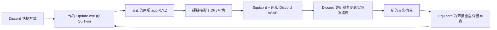

<p align="center">
  <a href="../README.md">EN</a> |
  <a href="README.ru.md">RU</a> |
  <a href="README.sr.md">SR</a> |
  <a href="README.pl.md">PL</a> |
  <a href="README.tr.md">TR</a> |
  <a href="README.fr.md">FR</a> |
  <a href="README.ar.md">AR</a> |
  <strong>ZH</strong>
</p>

<p align="center">
  
</p>

# QuiTwin

**面向 Windows Discord 的一键式耐更新 Equicord 启动器。**

[网站](https://ariesalex.github.io/QuiTwin/zh/) · [工作原理](#为什么-discord-更新会移除客户端模组)

[](https://github.com/AriesAlex/QuiTwin/actions/workflows/ci.yml)
[](https://github.com/AriesAlex/QuiTwin/releases/latest)
[](../LICENSE)

<p align="center">
  <a href="https://github.com/AriesAlex/QuiTwin/releases/latest/download/QuiTwin.exe"></a>
</p>
<p align="center"><strong>下载。运行一次。完成。</strong></p>

如果 Vencord 或 Equicord 总在 Discord 更新后消失，QuiTwin 就是为解决这个问题而做的。它无需后台服务、计划任务、DLL 注入，也不用反复修改正在使用的 `app.asar`。

> [!IMPORTANT]
> Discord 不支持客户端修改，使用模组可能违反其服务条款。使用 QuiTwin 与 Equicord 的风险由你自行承担。

## 下载与安装

1. [下载 **`QuiTwin.exe`**](https://github.com/AriesAlex/QuiTwin/releases/latest/download/QuiTwin.exe)。
2. 运行一次。
3. 完成。下载的 EXE 会自动删除；之后照常使用现有快捷方式启动 Discord。

QuiTwin 会自动：

- 找到 Stable、PTB 或 Canary，即使它不在 `C:` 盘；
- 如果尚未安装 Discord，则下载官方 x64 安装器并验证 Authenticode 签名；
- 下载最新的官方 Equicord `desktop.asar`；
- 将自身安装为 Discord 正常的 `Update.exe` 启动入口；
- 通过耐更新的硬链接运行环境启动 Discord；
- 安装成功后播放 Windows Proximity Notification 声音；
- 等待便携安装器退出，然后删除下载的 EXE。

社区构建没有商业代码签名，因此 Windows 可能显示 SmartScreen 警告。每个版本都由公开的 GitHub Actions 工作流构建，你也可以自行从源码编译。

## 为什么 Discord 更新会移除客户端模组

传统 Vencord 与 Equicord 安装器会替换或包装：

```text
Discord/app-X.Y.Z/resources/app.asar
```

Discord 当前的原生更新器位于 `updater.node`。它会下载新的 `app-X.Y.Z`、验证文件哈希、把版本写入 `installer.db`，并可能直接重启新的 `Discord.exe`。仅包装根目录的 `Update.exe` 无法拦截这种直接重启，而修改正在使用的 `app.asar` 也可能让差分更新失败。

QuiTwin 组合了两种机制：



1. **原版宿主：**真实 Discord 安装始终可以逐字节更新。
2. **硬链接影子：**QuiTwin 在 `.quitwin/runtime` 中创建按内容寻址的运行环境。Discord 文件使用 NTFS 硬链接，因此几乎不占额外磁盘空间。
3. **路径虚拟化：**一个很小的 JavaScript 加载器让原生更新器看到真实 EXE 与资源路径，同时 Equicord 从影子环境加载原版 ASAR。
4. **直接重启保护：**Equicord 的宿主更新 hook 会在 Discord 直接重启前准备刚刚提交的新宿主。
5. **下次普通启动：**QuiTwin 将宿主恢复为原版并创建下一代影子环境。

QuiTwin 不会留下常驻进程。`Update.exe` 准备环境、启动 Discord，然后退出。

## 可靠性设计

- `Update.exe` 通过原子替换并立即写入磁盘。
- 下载内容会先暂存、检查长度与格式、写入磁盘，再原子发布。
- 运行环境在一次性的 `.building-*` 目录中构建，并通过原子目录改名发布。
- 已发布的运行环境不可变；正在使用的环境永远不会被改写。
- 真实 Discord `app.asar` 永远不会被移到外部缓存。
- Equicord 成功加载后会写入 `.quitwin/last-launch.json` 供诊断使用。
- 不依赖 Discord 原始卸载程序；QuiTwin 使用同一个二进制文件处理 Windows 设置中的卸载。

断电最多只会留下未使用的暂存目录，不会留下写到一半的活动宿主或启动器。

## 更新与卸载

Discord 与 Equicord 继续正常更新。运行更高版本的 `QuiTwin.exe` 会升级已安装的启动器。

删除 Discord 与 QuiTwin：

**Windows 设置 → 应用 → 已安装的应用 → Discord → 卸载**

QuiTwin 会像普通 Discord 卸载一样，在 `%APPDATA%` 中保留用户数据与 Equicord 设置。

## 支持的系统

- Windows 10 或 11
- Discord Stable、PTB 或 Canary x64
- NTFS，因为需要硬链接

如果没有安装 Discord，QuiTwin 会安装 Stable x64。存在多个频道时，优先级为 Stable、PTB、Canary。

## 从源码构建

需要带有 `x86_64-pc-windows-msvc` target 的 Rust stable，以及包含 MSVC 链接器的 Visual Studio Build Tools。

```powershell
cargo test --all-targets
cargo build --locked --release
```

二进制文件位于 `target\release\quitwin.exe`。

## 项目范围与许可证

QuiTwin 当前安装的是 Equicord，它是 Vencord 的扩展分支。架构本身不依赖某个模组，但目前还不能选择 Vencord 作为 payload。

QuiTwin 独立于 Discord、Equicord、Vencord 与 Squirrel。

[MIT](../LICENSE)
